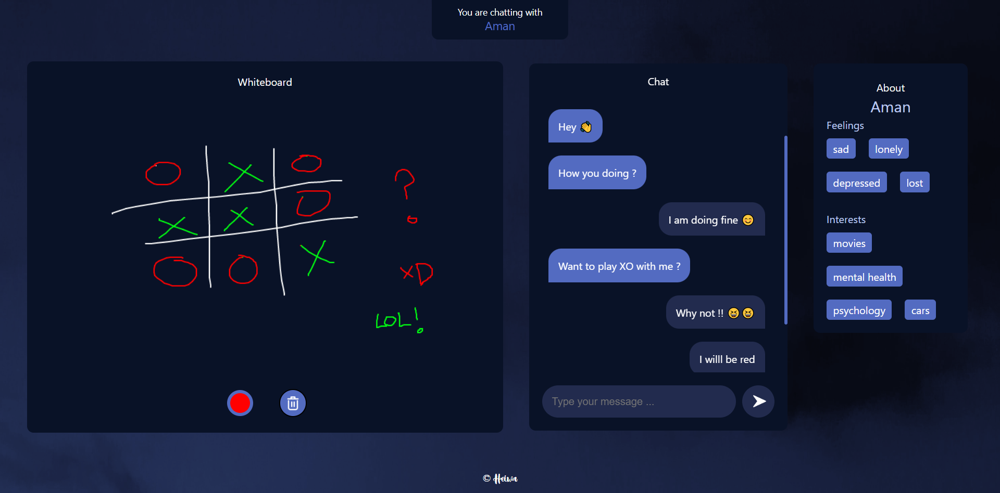

<p align="center">
   
</p>
<h1 align="center">Heiwa 🕊</h1>
<h3 align="center">An end to end anonymous chatting application where people talk about their mental health.</h3>

<p align="center">
    
      
      
     
</p>
<p align="center">
  <a href="#key-features">Key Features</a> •
  <a href="#local-setup">Local Setup</a> •
  <a href="#how-to-use">How To Use</a> 
  
</p>

<p align="center">
   
</p>
<p align="center">
   
</p>

## Key Features

* LivePreview - Make changes, See changes
  - Instantly see what your Markdown documents look like in HTML as you create them.
* Sync Scrolling
  - While you type, LivePreview will automatically scroll to the current location you're editing.
* GitHub Flavored Markdown  
* Syntax highlighting
* [KaTeX](https://khan.github.io/KaTeX/) Support
* Dark/Light mode
* Toolbar for basic Markdown formatting
* Supports multiple cursors
* Save the Markdown preview as PDF
* Emoji support in preview :tada:
* App will keep alive in tray for quick usage
* Full screen mode
  - Write distraction free.
* Cross platform
  - Windows, macOS and Linux ready.

## Local Setup

To clone and run this application, you'll need [Git](https://git-scm.com) and [Node.js](https://nodejs.org/en/download/) (which comes with [npm](http://npmjs.com)) installed on your computer. From your command line:

```bash
# Clone this repository
$ git clone https://github.com/amitmerchant1990/electron-markdownify

# Go into the repository
$ cd electron-markdownify

# Install dependencies
$ npm install

# Run the app
$ npm start
```

> **Note**
> If you're using Linux Bash for Windows, [see this guide](https://www.howtogeek.com/261575/how-to-run-graphical-linux-desktop-applications-from-windows-10s-bash-shell/) or use `node` from the command prompt.


## How To Use

You can [download](https://github.com/amitmerchant1990/electron-markdownify/releases/tag/v1.2.0) the latest installable version of Markdownify for Windows, macOS and Linux.
# Heiwa-react
